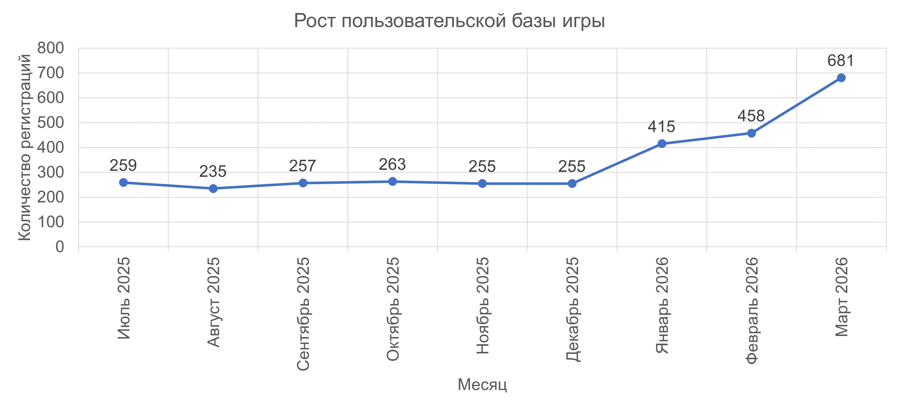

# Planet Hunt

SQL-анализ продуктовых метрик мобильной игры.

Проведён комплексный анализ пользовательской активности, монетизации,
реферальной программы и маркетинговых активностей мобильной игры.

---

## Быстрые ссылки
- 📂 [Исходные данные](data/)
- 📚 [Документация](docs/)
- 🖼️ [Визуализации](images/)
- 📊 [Презентация](presentation/planet-hunt-analysis-presentation.pdf)
- 📈 [Отчёты и результаты анализа](reports/)
- 📝 [SQL-запросы](sql/)
- 📋 [DEVLOG — история выполнения проекта](DEVLOG.md)

---

## Структура проекта

| Раздел | Содержание |
|---|---|
| `data/` | Исходные данные для анализа |
| `docs/` | Описание проекта, словарь данных и ТЗ |
| `images/` | Визуализации для README |
| `presentation/` | Итоговая презентация |
| `reports/` | Результаты запросов и Excel-отчёты |
| `sql/` | SQL-запросы и расчёты |
| `DEVLOG.md` | История выполнения проекта |
| `README.md` | Описание проекта и навигация |
---

## Бизнес-задача

Команда игры хочет понять:

- насколько активно пользователи взаимодействуют с продуктом;
- какие маркетинговые активности дают рост;
- какие факторы влияют на монетизацию;
- насколько эффективна реферальная программа.

---

## Используемые данные

- профили игроков;
- игровые сессии;
- покупки;
- реферальная программа;
- история изменения цен;
- каталог игровых объектов.

---

## Выполненный анализ

### Качество данных

- проверка пропусков и дубликатов;
- анализ качества игровых сессий;
- выявление технических проблем в данных.

### Пользовательская активность

- DAU;
- WAU;
- MAU;
- Sticky Factor;
- количество и длительность игровых сессий;
- анализ вовлечённых пользователей.

### Регистрации и рост аудитории

- динамика регистраций;
- анализ периодов привлечения пользователей;
- оценка изменения пользовательской базы.

### Маркетинговые активности

- анализ мартовской маркетинговой акции;
- оценка влияния акции на пользовательскую активность;
- анализ изменения стоимости топлива как внешнего фактора.

### Монетизация

- динамика выручки по игровым объектам;
- анализ изменения цен;
- когортный анализ выручки;
- средняя месячная выручка на пользователя.

### Реферальная программа

- анализ приглашений;
- конверсия приглашений в регистрации;
- K-factor;
- оценка органического роста.

### Лояльная аудитория

- определение критериев лояльности;
- LMAU по реферальной активности;
- LMAU по платежам;
- LMAU пользователей, соответствующих обоим критериям;
- LMAU пользователей, соответствующих хотя бы одному критерию.
---

## Ключевые результаты

- выявлена проблема качества данных игровых сессий: 12% записей не содержали времени завершения, 97% таких записей приходилось на iOS;
- пользовательская активность и динамика регистраций проанализированы
  по основным продуктовым метрикам DAU, WAU и MAU;
- мартовская маркетинговая акция сопровождалась ростом пользовательской активности;
- новые когорты показывают более высокий уровень месячной выручки на пользователя;
- K-factor реферальной программы составил 0.92;
- пользователи из когорт ноября–декабря 2025 года проводили в игре
  в среднем 3 ч 37 мин против 2 ч 57 мин в остальных когортах;
- выявлены пользователи с повышенной ценностью для продукта по критериям
  платежей и реферальной активности.

---

## Визуализации

### Рост пользовательской базы

### DAU / WAU / MAU

### Sticky Factor

### Когортный анализ выручки

---

## Подготовка результатов

SQL-запросы выполнялись в DBeaver.

Результаты экспортировались в CSV и загружались в Excel через Power Query для построения сводных таблиц и графиков.

Файлы выгрузок и итоговые Excel-отчёты находятся в папке reports.

---

## Инструменты

SQL • DBeaver • Excel • Google Sheets • Power Query • Google Slides
