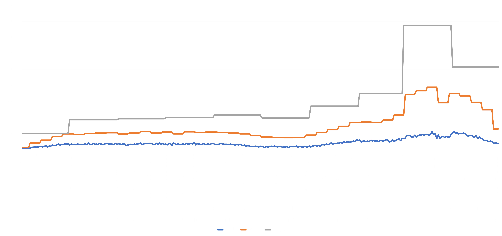

# Planet Hunt

SQL-анализ продуктовых метрик мобильной игры.

## Проект в двух словах

Проведён комплексный анализ пользовательской активности, монетизации,
реферальной программы и маркетинговых активностей мобильной игры.

Исследование выполнено на данных 3 078 игроков и 27 161 игровой сессии.

---

## Быстрые ссылки

📊 [Презентация](presentation/planet-hunt-analysis-presentation.pdf)

📖 [Описание проекта](docs/project_description.md)

📚 [Словарь данных](docs/data_dictionary.md)

📝 [DEVLOG](DEVLOG.md)

💾 [SQL-запросы](sql/)

---

## Бизнес-задача

Команда игры хочет понять:

- насколько активно пользователи взаимодействуют с продуктом;
- какие маркетинговые активности дают рост;
- какие факторы влияют на монетизацию;
- насколько эффективна реферальная программа.

---

## Используемые данные

- профили игроков;
- игровые сессии;
- покупки;
- реферальная программа;
- история изменения цен;
- каталог игровых объектов.

---

## Выполненный анализ

### Качество данных

- поиск пропусков;
- поиск дублей;
- анализ технических ошибок.

### Пользовательская активность

- DAU;
- WAU;
- MAU;
- Sticky Factor;
- длительность игровых сессий.

### Маркетинговые активности

- анализ акции марта 2026 года;
- влияние акции на пользовательскую активность.

### Монетизация

- влияние изменения цен;
- когортный анализ выручки;
- средняя выручка на пользователя.

### Реферальная программа

- анализ приглашений;
- K-factor;
- оценка органического роста.

### Лояльная аудитория

- LMAU;
- анализ платящих пользователей;
- анализ активных рефереров.

---

## Ключевые результаты

- пользовательская база стабильно росла;
- маркетинговая акция увеличила количество активных пользователей почти в 3 раза;
- новые когорты показывают более высокий уровень монетизации;
- K-factor составил 0.92;
- обнаружена проблема качества данных на iOS;
- реферальная программа обеспечивает дополнительный органический рост.

---

## Визуализации

### Рост пользовательской базы

### DAU / WAU / MAU

### Sticky Factor

### Когортный анализ выручки

---

## Инструменты

SQL • DBeaver • Excel • Google Sheets • Power Query • Google Slides
